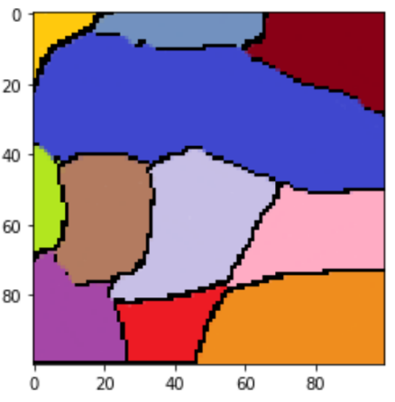
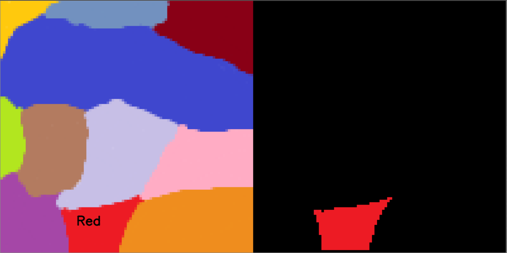
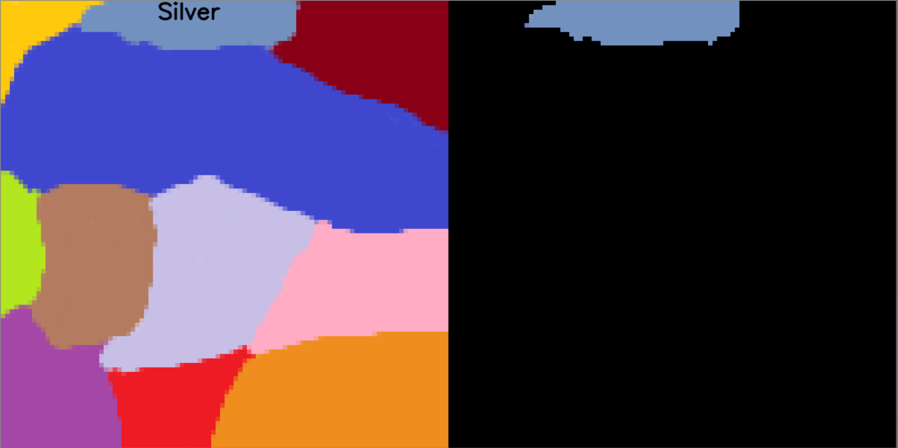
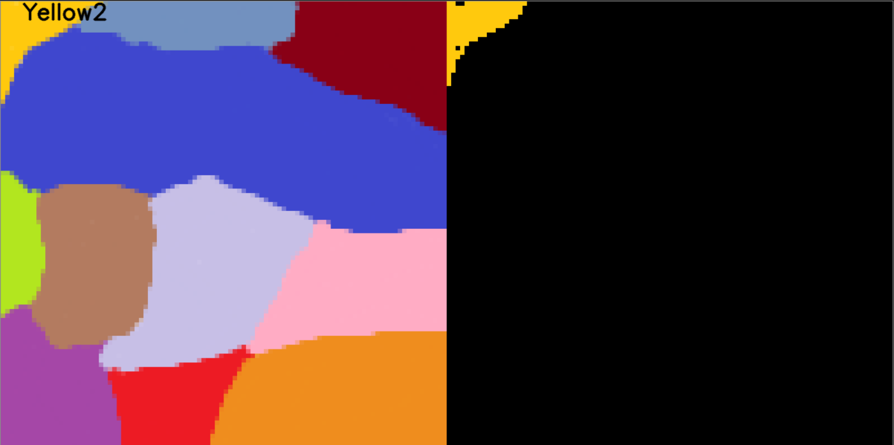
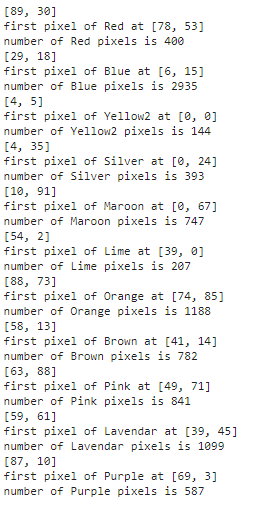

# Basic-Color-Identification-Program-
This program performs a combination of contouring, color segmentation and labeling to allow the user to recognize a pre-defined set of colours from within a simple image.

1. Download the provided python file: 'Assignment2Final.png' from the folder: 'ENGR7761-ColourIdentification' and open it via jupyter lab.
2. For the scope of the project, use the 'steve2.png' as the file to be experiment upon (the line of interest: pic = Image.open('steve2.png'))

  

3. To run the code, shift + enter throuhgout each section within the juptyter lab interface.
4. Upon conducting the initial program, the concept of contouring will be covered, resulting in an image, produced as follows (this contouring can be manipulated through the threshold variable): 

  

5. Following this, the next features explored shall be the simultaneous execution of colour segmentation and labeling. Upon running this section, a <i>cv2.imshow</i> shall result in a series of pop-up displays. A few examples of such displays are shown below:

  

  

  

6. Upon completing this production of a slideshow of images, mathematical variables pertaining to the calculations implemented within the code were conducted and printed via the jupyter lab interface. The three variables are shown below, and are individually printed as the user cycles through the program (the program can be cycled through any user key input).

  

7. With this, all information and results obtainable through this project should be readily available to the user.
